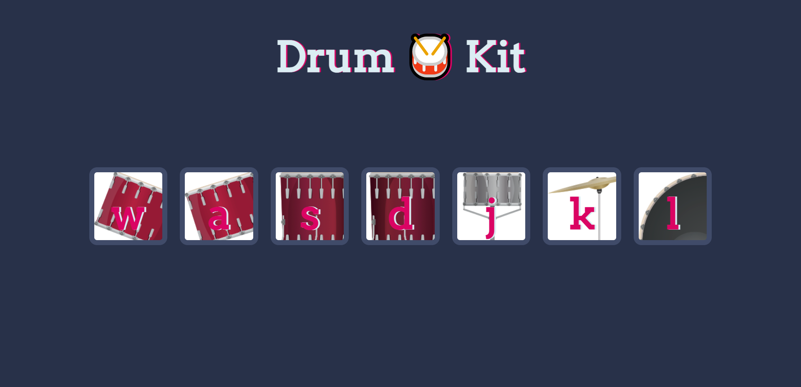

# Drum Kit Website

This repository contains a simple web application that lets users play various drum sounds by either clicking on the drum parts displayed on the webpage or by using specific keyboard keys. The project is built using HTML, CSS, and JavaScript.

## Usage

1. Clone the repository to your local machine: `git clone https://github.com/AavashGyawali/DrumKit`

2. Open the `index.html` file in a web browser.

3. Click on the different drum parts shown on the webpage to hear the corresponding drum sounds. Alternatively, use the associated keyboard keys to trigger the sounds.

## Images

